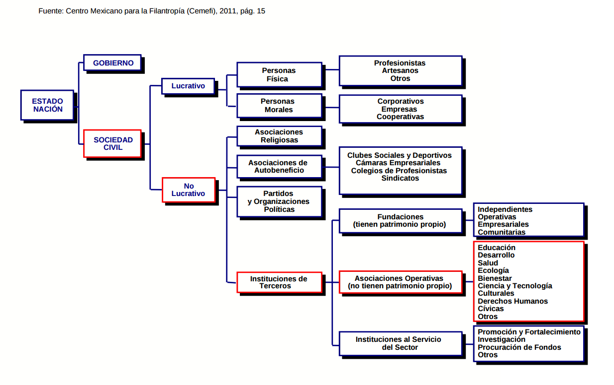
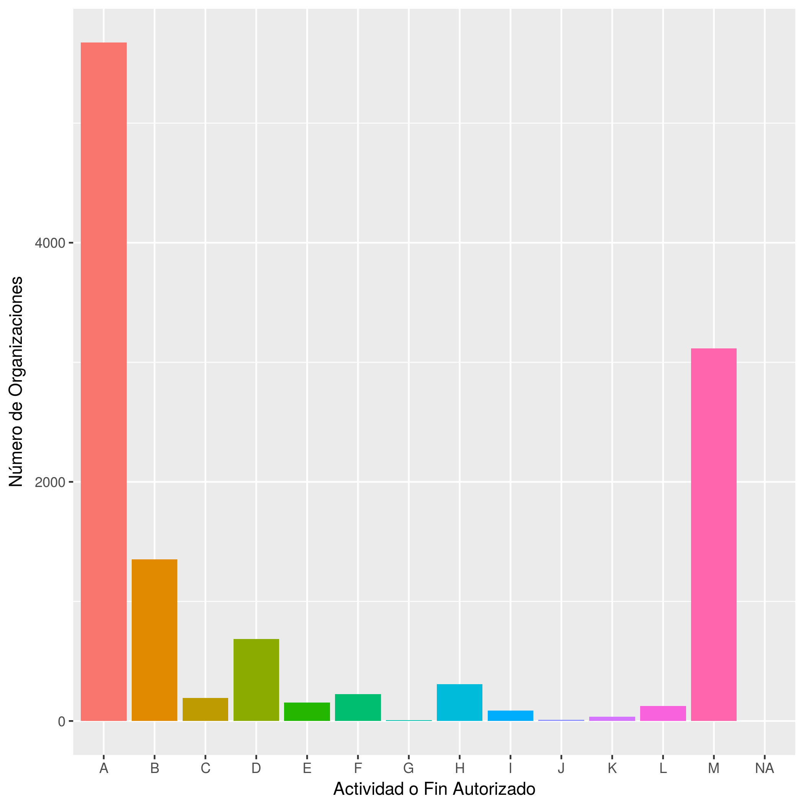

# Proyecto de Análisis de Sociedad Civil en México

INEGI define a las Instituciones Sin Fines de Lucro como organizaciones sociales no lucrativas por ley o por costumbre que al no perseguir beneficios, no distribuyen los excedentes que pudieran generar; sus decisiones y gestión son institucionalmente autónomas y separadas del gobierno, además de no imponer coercitivamente la participación en ellas (Instituto Nacional de Estadística y Geografía, 2012).

Existen una variedad de términos utilizados para este tipo de organizaciones, como el término ONG, institución sin fines de lucro, organización del tercer sector, organización de la sociedad civil.  Así también existe una variedad de figuras legales y marco normativo que las rigen. 

## Figuras legales
- AC
- SC
- SCP
- FBP
- IAP
- IBP
- Fideicomiso

Del análisis de la base de datos una Organización puede tener varias figuras legales, la siguiente tabla describe el número de organizaciones y su correspondencia para cada figura legal:

| AC| SC| SCP| ABP| IAP| Fideicomiso| Banco| Fundación| IASP| IBP|Número de Organizaciones|
|--:|--:|---:|---:|---:|-----------:|-----:|---------:|----:|---:|----:|
|  0|  0|   0|   0|   0|           0|     0|         0|    0|   0|   29|
|  0|  0|   0|   0|   0|           0|     0|         0|    0|   1|   21|
|  0|  0|   0|   0|   0|           0|     0|         0|    1|   0|    8|
|  0|  0|   0|   0|   0|           0|     0|         1|    0|   0|   30|
|  0|  0|   0|   0|   0|           0|     0|         1|    0|   1|   24|
|  0|  0|   0|   0|   0|           0|     0|         1|    1|   0|    1|
|  0|  0|   0|   0|   0|           0|     1|         0|    0|   0|    2|
|  0|  0|   0|   0|   0|           0|     1|         1|    0|   0|    1|
|  0|  0|   0|   0|   0|           1|     0|         0|    0|   0|   14|
|  0|  0|   0|   0|   0|           1|     1|         0|    0|   0|   11|
|  0|  0|   0|   0|   1|           0|     0|         0|    0|   0|  705|
|  0|  0|   0|   0|   1|           0|     0|         0|    1|   0|    1|
|  0|  0|   0|   0|   1|           0|     0|         1|    0|   0|  253|
|  0|  0|   0|   0|   1|           0|     1|         0|    0|   0|   15|
|  0|  0|   0|   1|   0|           0|     0|         0|    0|   0|  127|
|  0|  0|   0|   1|   0|           0|     0|         1|    0|   0|   10|
|  0|  1|   0|   0|   0|           0|     0|         0|    0|   0|  239|
|  0|  1|   0|   0|   0|           0|     0|         1|    0|   0|    5|
|  0|  1|   1|   0|   0|           0|     0|         0|    0|   0|    3|
|  1|  0|   0|   0|   0|           0|     0|         0|    0|   0| 6119|
|  1|  0|   0|   0|   0|           0|     0|         0|    1|   0|    2|
|  1|  0|   0|   0|   0|           0|     0|         1|    0|   0| 1194|
|  1|  0|   0|   0|   0|           0|     0|         1|    1|   0|    3|
|  1|  0|   0|   0|   0|           0|     1|         0|    0|   0|   42|
|  1|  0|   0|   0|   0|           0|     1|         1|    0|   0|    2|
|  1|  0|   0|   0|   0|           1|     0|         0|    0|   0|    1|

## Marco Normatico
### Internacional
- Tratados Internacionales (Declaración derechos humanos, Pacto Internacional de derechos civiles, COnvención americana de derechos humanos) Firmados por distintos paises todos reconocen el derecho a la asociación y libre reunión.
### Local
- Constitución (Derecho Asociación y Reunión Art 9no - Art 25) y reconoce los tratados 
- Leyes Federales (Contenidos - Leyes sustantivas) y Generales (Competencias)
### Por cada figura legal
#### Sociedades Civiles
- Código Civil (a.c y Sociedades Civiles)
- Código civil estatal
#### IAPS
Se rigen a nivel local por la ley estatal de instituciones de asistencia privada.
Como se defina por ese estado
- Ley de Instituciones de Asistencia privada (IAP) Estatales o su equivalente

#### Fideicomisos
Figura de derecho financiero, su regulación a nivel federal o local depende de las legislaciones financieras, bancarias y mercantiles. Aunque por su característica de administradora de fondos también se usa para fondos sociales que califican como donataria autorizada. Por esta razón (aunque esté creada para fines lucrativos) entra dentro de la categoría de no lucrativa.

## Estatus Jurídico para no lucrativa.

Lucrativa
- Persona Moral - Título 2 Ley de ISR 
- Persona Física - Título 1 Ley de ISR
No lucrativa 
- Persona Moral - Título 3 Ley de ISR

Estatus para fines de tratamiento fiscal. 
No está claro a partir del 2014 si las organizaciones que tienen un fin no lucrativo pero no son donatarias tributan en ese título porque ha habido interpretaciones en las que se asume que solo aquellas que tienen la donataria autorizada tributan en ese título.

### Asociaciones Civiles
### Donatarias Autorizadas
El título tercero  de la ley del impuesto sobre la renta en su artículo Artículo 79 y 80 regula el tratamiento fiscal preferencial de las organizaciones sin fines de lucro que cumpliendo con los requisitos de la misma ley obtienen el tratamiento de ese estatus.
Cuya principal ventaja es la excensión del pago del impuesto sobre la renta. Entre las obligaciones que se adquieren con esta figura está la entrega de informes de transparencia, declaraciones fiscales e informes detallados sobre los donantes para efectos de la ley antilavado entre otros.

El SAT organiza a las Donatarias Autorizadas de la siguiente manera:

- A. Organizaciones civiles y fideicomisos asistenciales (artículo 79, fracción VI de la Ley del ISR)
- B. Organizaciones civiles y fideicomisos educativos (artículo 79, fracción X de la Ley del ISR)
- C. Organizaciones civiles y fideicomisos para la investigación científica o tecnológica (artículo 79, fracción XI de la Ley del ISR)
- D. Organizaciones civiles y fideicomisos culturales (artículo 79, fracción XII de la Ley del ISR)
- E. Organizaciones civiles y fideicomisos becantes (artículos 79, fracción XVII y 83 de la Ley del ISR)
- F. Organizaciones civiles y fideicomisos ecológicos (artículo 79, fracción XIX de la Ley del ISR)
- G. Organizaciones civiles y fideicomisos para la reproducción de especies en protección y peligro de extinción (artículo 79, fracción XX de la Ley del ISR)
- H. Organizaciones civiles y fideicomisos de apoyo económico de donatarias autorizadas (artículo 82, penúltimo párrafo de la Ley del ISR)
- I. Organizaciones civiles y fideicomisos para obras o servicios públicos (artículo 36, segundo párrafo del Reglamento de la Ley del ISR)
- J. Organizaciones civiles y fideicomisos propietarios de bibliotecas privadas con acceso al público en general (artículo 134 del Reglamento de la Ley del ISR)
- K. Organizaciones civiles y fideicomisos propietarios de museos privados con acceso al público en general (artículo 134 del Reglamento de la Ley del ISR)
- L. Organizaciones civiles y fideicomisos de desarrollo social (artículo 79, fracción XXV de la Ley del ISR)
- M. Organizaciones civiles y fideicomisos autorizados para recibir donativos deducibles en los términos del Convenio para Evitar

### Fuentes

- UNA MIRADA A LAS ORGANIZACIONES DE LA SOCIEDAD CIVIL EN MÉXICO. PERTINENCIA DE SU ESTUDIO DESDE LA ADMINISTRACIÓN. Universidad Nacional Autónoma de México. http://congreso.investiga.fca.unam.mx/docs/xviii/docs/16.14.pdf
- Directorio de Donatarias Autorizadas 2016 (publicadas en el D.O.F. el 12 de enero, 09 de mayo y 15 de julio de 2016). Obtenida de http://www.sat.gob.mx/terceros_autorizados/donatarias_donaciones/Documents/dir163.xls